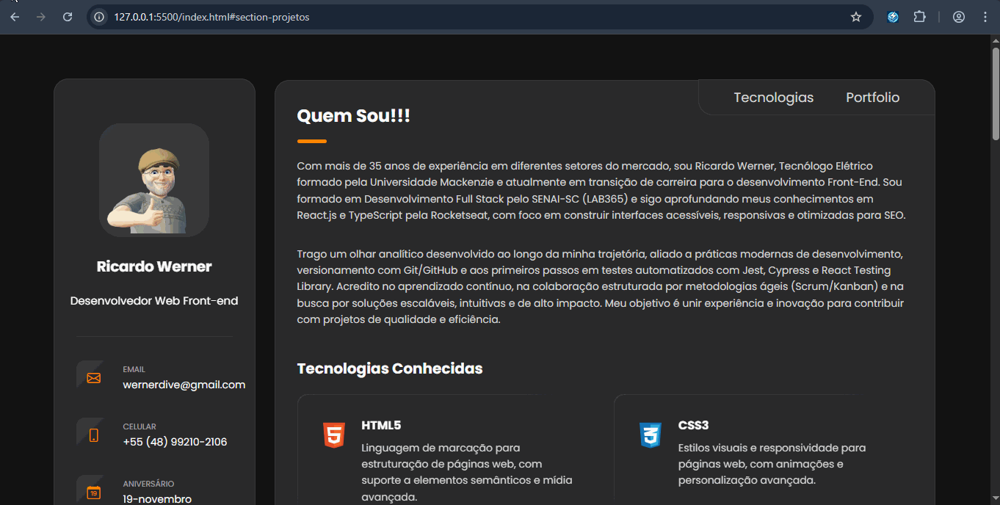
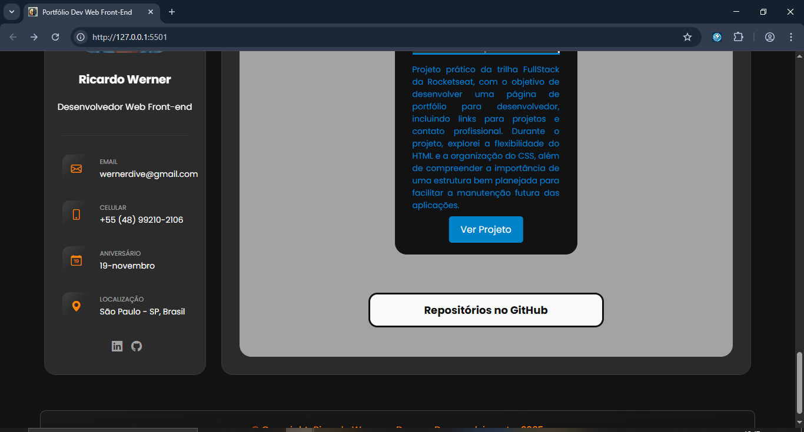
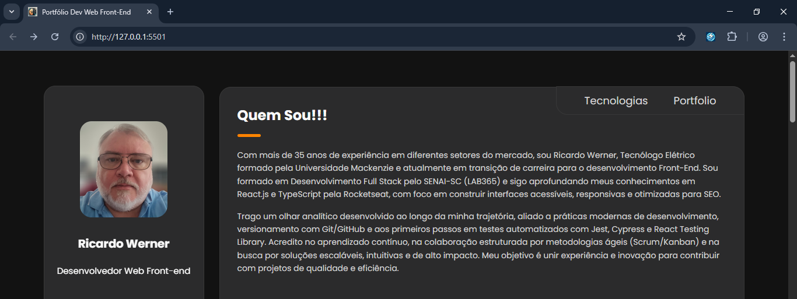
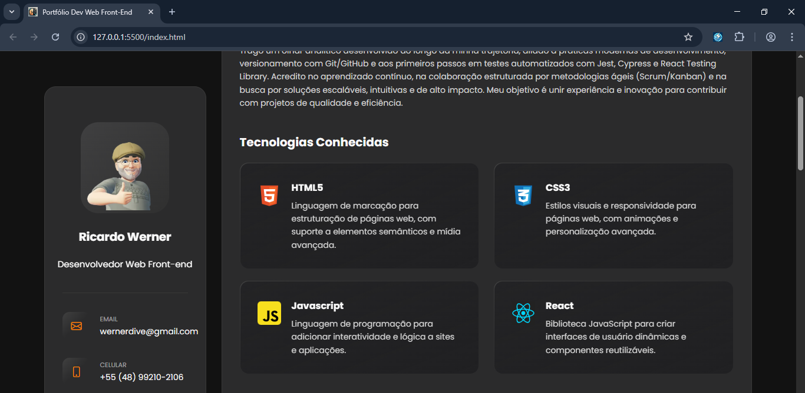
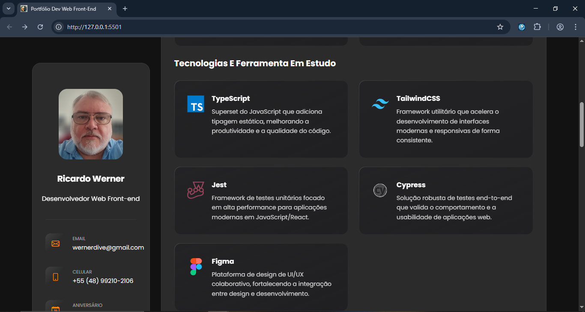
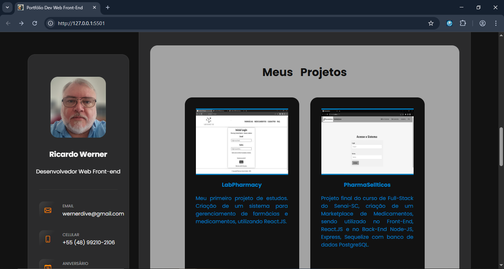
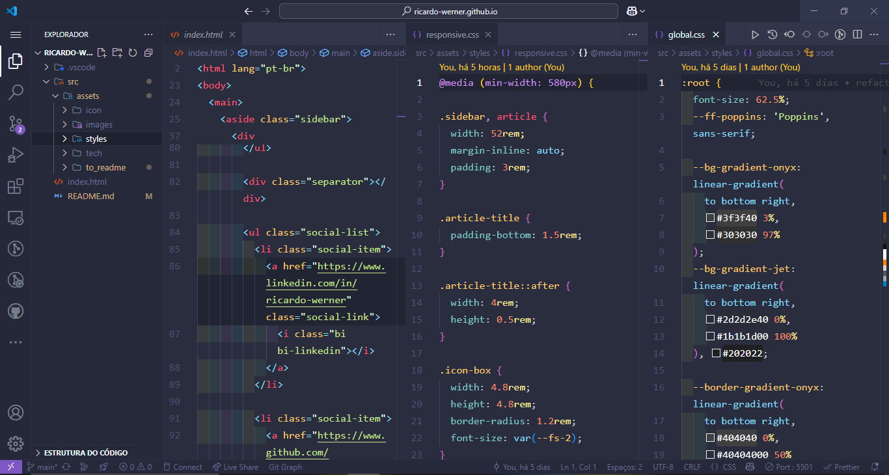
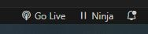
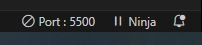
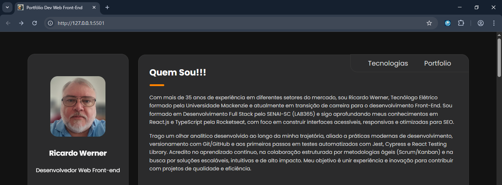

# Portfólio Pessoal – Desenvolvedor Front-End

Este projeto foi desenvolvido com o objetivo de aplicar e consolidar conhecimentos fundamentais em HTML5, CSS3 e JavaScript, construindo uma página de portfólio pessoal moderna, responsiva e funcional.

## 🧾 Página de Apresentação Profissional

### 📌 Sobre o Projeto

Este portfólio tem como foco apresentar minha trajetória profissional, tecnologias dominadas e principais projetos desenvolvidos até o momento. A página foi estruturada com HTML semântico, estilizada com CSS moderno e responsivo e dinamizada com funcionalidades em JavaScript puro.

O layout foi pensado para proporcionar uma navegação fluida e visualmente agradável, além de destacar meu compromisso com boas práticas de desenvolvimento Front-End.

O projeto também serve como base para futuras evoluções, incluindo integração com testes manuais/automatizados e novos projetos em React.js e TypeScript.

---

### 🔗 Links Úteis

- 

- 

### ✅ Status do Projeto

**Em Desenvolvimento**

### 🎥 Deploy

https://ricardo-werner.github.io/

#### Gif da Página do Portfólio

  

#### Tela Dados Pessoais

  

#### Tela Inicial Portfólio

  

#### Tela Tecnologias Conhecidas

  

#### Tela Tecnologias e Ferramenta em Estudo

  

#### Tela Projetos

  

#### Tela do Código

  

### 🧩 Desafio

O maior desafio foi equilibrar funcionalidade e estética, criando uma interface atrativa e responsiva, enquanto resolvia problemas de layout e compatibilidade entre navegadores.

### 📝 Requisitos da Aplicação

| Item | Descrição                                                              |
| ---- | ---------------------------------------------------------------------- |
| 1    | A página deve ser desenvolvida em HTML, CSS e Javascript               |
| 2    | Base de design foi pesquisado na internet                              |
| 3    | Modelagem do layout, formatos, tipografias, cores e organização livre. |

### 🚀 Plano do Projeto

No desenvolvimento desta página, foram aplicados os seguintes conceitos:

| Item | Descrição  |
| ---- | ---------- |
| 1    | HTML       |
| 2    | CSS        |
| 3    | Javascript |

### 🛠 Tecnologias Utilizadas

- **Visual Studio Code**
- **HTML**
- **CSS**
- **Javascript**
- **Documentação**
- **ChatGpt**

### 💡 Reflexões

Este projeto foi uma ótima oportunidade para consolidar conhecimentos, aprimorar habilidades em UI/UX e entender melhor os detalhes que fazem a diferença na experiência do usuário.

### 📦 Como Executar o Projeto

1. Clone o repositório:

   git clone https://github.com/ricardo-werner/ricardo-werner.github.io.git

2. Abra o projeto no Visual Studio Code e ative o Go Live:

   

     
   

   

     
   

3. Visualize o resultado na página web:

   

     
   

### 🙋‍♂️ Autor

Ricardo Werner 
Dev em Desenvolvimento
